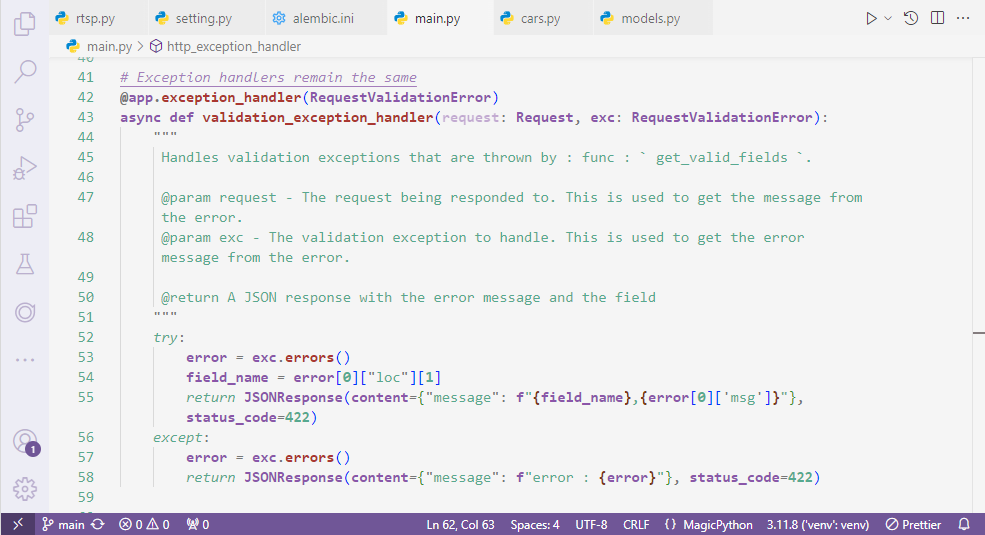

# Violet Breeze 🌸

**Violet Breeze** is a carefully crafted Visual Studio Code theme that blends gentle light tones with vibrant shades of purple. Designed for coders who want a bright yet calming workspace, this theme provides a balance of readability and elegance, making long coding sessions a breeze.

### Features ✨

- **Soft light background**: Reduces eye strain while keeping the interface bright and clean.
- **Elegant purple highlights**: Pops of violet for syntax highlighting to make your code easy to follow and aesthetically pleasing.
- **Consistent design**: Every element is thoughtfully color-coordinated for a seamless and professional look.

### Perfect For:
- Developers who enjoy light themes with a subtle twist of purple.
- Those who need a clean and comfortable interface for focus and productivity.
- Fans of elegant color schemes that remain stylish without distraction.

### Preview 🌈
  
(*Add a screenshot of your theme in action*)

### Installation 📦
1. Open Visual Studio Code.
2. Go to the Extensions view by clicking on the Extensions icon in the Activity Bar.
3. Search for **Violet Breeze** and click **Install**.
4. Select **Violet Breeze** from the theme dropdown in the Command Palette (`Ctrl+K Ctrl+T`).

Enjoy coding with a fresh new vibe! 🎨
